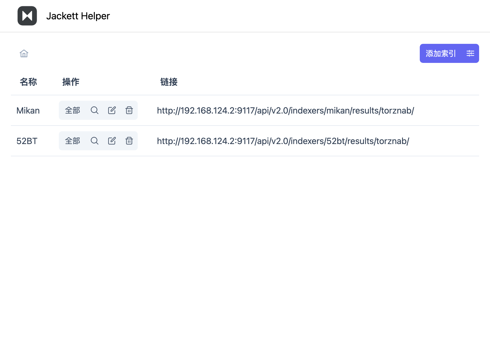

# Jackett Helper


这是一个将Jackett链接添加到Aria任务的工具，由ElysiaJS和Vue开发

前端页面的仓库[在这里](https://github.com/Zhoucheng133/Jackett-Helper-Web)

## 截图




## 部署

本项目需要使用Docker进行配置

1. 前往Release页面下载docker文件（压缩包）<sup>*</sup>
2. 解压并复制到你的服务器上
3. 使用命令生成镜像`sudo docker build -t jakett_helper <文件夹目录>`
4. 使用下面的命令生成容器

```bash
sudo docker run -d \
--restart always \
-p <主机端口>:3000 \
-v <主机上存储数据库的位置>:/app/db \
--name jakett_helper jakett_helper
```

<sup>*</sup> 或者你可以将[前端页面](https://github.com/Zhoucheng133/Jackett-Helper-Web)生成的静态文件复制到本项目的web文件夹中，若要在Docker上部署，文件结构应该是这样
```
📁 项目根目录/
├── 📄 bun.lockb
├── 📄 Dockerfile
├── 📄 package.json
├── 📄 tsconfig.json
├── 📁 src/
│   ├── 📄 index.ts
│   └── 📁 routes/
│       └── ...其他文件
├── 📁 web/
│   ├── 📄 icon.svg
│   ├── 📄 index.html
│   └── 📁 assets/
│       └── ...其他文件